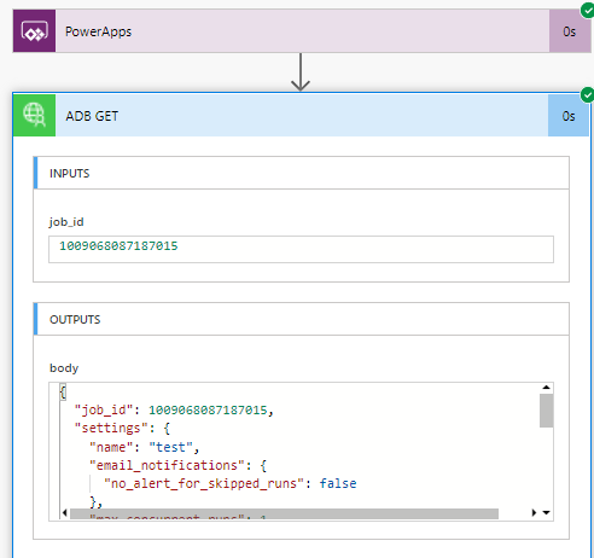

# Building Native OAuth2.0 based Flow Integration with Azure Databricks

In this small repo, we are trying to show how easy and out-of-box to set up Azure Active Directory (AAD) OAuth2.0 based Power Apps Flow integration with Azure Databricks.

> Note: Same approach (almost 99.9% same steps) can be repeated if you are using Azure Logic App for building any Business Integration Solution with Azure Databricks

## Scenario:

- *End User to System:* There is front end portal which can be accessed by authenticated/authorized users from Azure AD (AAD). This portal has one interface which is nothing but some function or code button <behind the scenes code/ or javascript/ let's assume>. User interact with this function by trigger this function by feeding information or it can be static function without input (use case be anything). 

- *Portal to Power Apps Flow:* Once function trigger, it triggers Microsoft Power  Apps Flow behind the scene (Logic App equivalent in Azure, based upon http request). Gone are those days, where we need to club everything together. Using Power Apps Flow/Azure Logic App, application process can easily be de-coupled. 

- *Power Apps Flow to Azure Databricks (ADB):* Now comes the interesting part, ADB can be non-interactively consumed from using many ways. In this repo, we shall see how Natively Power Apps  Flow can talk to ADB and seamless perform OAuth token exchange for query execution on its (while request coming from Flow by End User vis Some Interface i.e. GUI).

## High Level Design

Using combination of various component. We can achieve seamless secure natively authenticated request flow to ADB. 

### Components in Play
- Power Apps Custom Connector
- Power Apps Flow
- Azure Databricks 
- Azure Active Directory Application (aka Service Principal)
- Azure Active Directory Application API Permission

> Assumption: You have Power Apps Portal already set up as well as Azure Databricks cluster. We shall only show how to set up integration Power Apps Flow to ADB

### Steps 

> Assumption: You have AAD Application Created for ADB which will be consumed by Power App Flows Connector and have noted down Application ID and Associated Secret. 

1. **Build Custom Connector**

    1.1. **Create Custom Connector**: Inside Power Apps portal, go to 'Data>Custom Connector' and create connector from scratch. Use 'Create from blank'.
    
    
    
    1.2. **Add Securityy Details**: Add your ADB Cluster URL 
    
    

    Add AAD Application Client ID/Associate Secret Details. Note down **"Redirect URL"** and add **"Resource URL"** ``2ff814a6-3304-4ab8-85cb-cd0e6f879c1d``. Scope should be **"user_impersonation"**

    

    1.3 **Update AAD Application Return URL**: Now add Return URL (Copied from Step 1.2 to Application created in AAD, so that URIs will accept as destinations when returning authentication responses (tokens). 

    

    1.4 **Add AAD Application API Permission for ADB**: Add ``user_impersonation`` API Permission for ADB. If you don't have permission, work with your AAD Administrator

    

    1.5 **Add Definition**: Hope you have added sample Job in ADB to test. If not, it is simple. Just inside your ADB, create Job and note down ``Job ID``. We shall use this ``Job ID`` to test out end-to-end connectivity.

    Add Definition/Action to your Connector so that it knows what it needs to do. 

    Add Action Name/Operation ID of Trigger
    
     

    Create Action Request

    

    Add Parameter for Action Request

     

    1.6 **Test Connector**: Post updating connector. Perform Test so that we are sure that it is working and returning result. Now here you will use ``Job ID`` of ADB which you have noted down in step 1. ``Status 200`` mean everything working fine

    

2. **Create Connection**: Post Connector Provision, create Connection. Once prompt comes-up, use credential to authorize it. 

    

3. **Create Flow and Test Connection**: Create sample Power Apps Flow. Sample Action where you can start seeing your custom connection and associated `Actions`.

    

    

4. **Bonus Step: Validate How AAD Interaction is happening and Token Exchanges**: You can validate how Connector, ADB, Power Apps, Flow are all working together and interacting with AAD by going into ``Sign-in logs``

    

### Accolades

- Special appreciation to **Pooja Sinde** who has written excellent [medium article](https://medium.com/@poojaanilshinde/create-azure-logic-apps-custom-connector-for-azure-databricks-e51f4524ab27) on same topic using different auth approach

- My colleague and friend **[Charles Bernard](http://github.com/charlesb)** who was partner in-crime to debug and find out hidden magic behind the scene and co-author of this repo.

